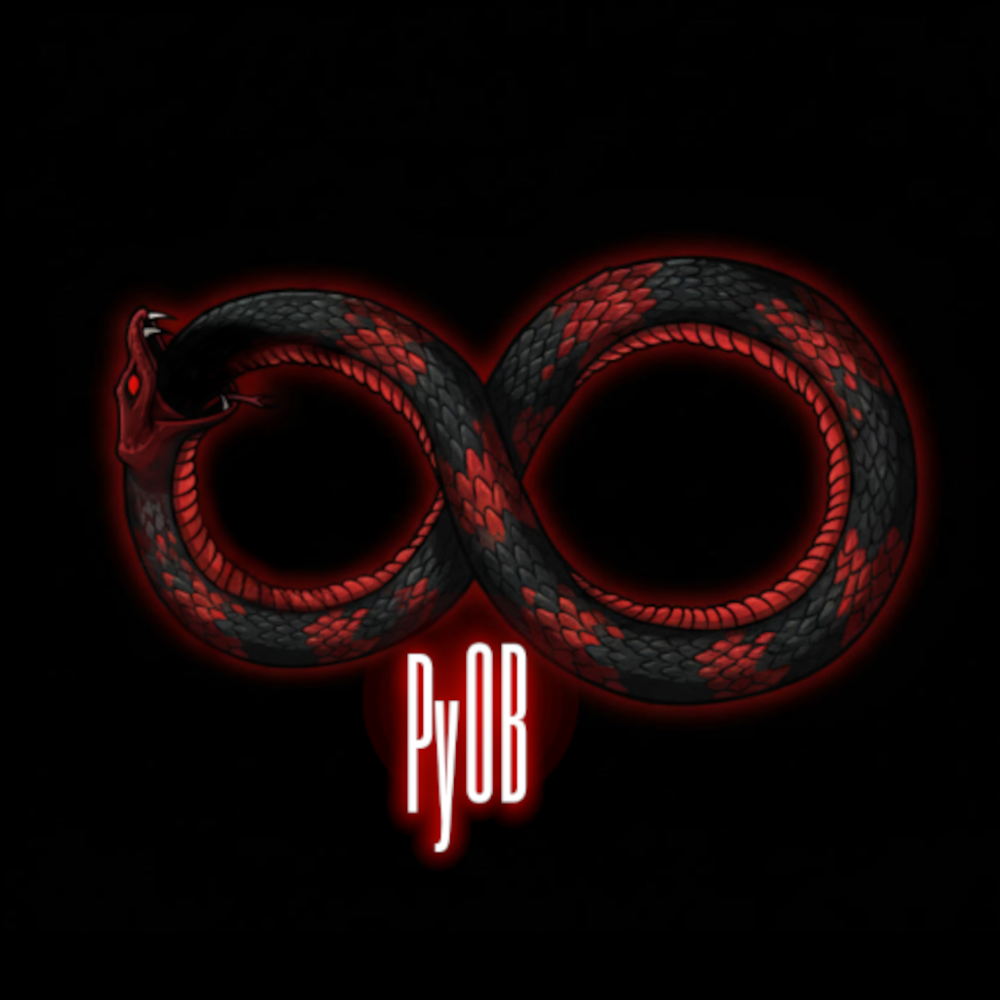

  

# ∞ PyOuroBorus

### The Self-Healing, Symbolic Autonomous Code Architect

**PYOB is a high-fidelity autonomous agent that performs surgical code modifications, cross-file dependency tracking, and self-healing verification — all without destroying your codebase.**

I built this shit for me myself and I, if you want to know how this works send me an email at vicsanity623@gmail.com and maybe ill read it.

I got sick and tired of the fucking internet belittleing me for writing such poor quality code completely missing the intention and purpose.

I know god damn well i have zero years experience in code languages and writing code.

But i dont give a fuck!

i build shit i think of! plain and simple

and it fuckin works exactly the way i imagine them to

so if thats not proof that i know how to get shit done then let this fuckin epic open source repo prove to all you fuckin pretentious fucks that you never need to take a single course for coding in 2026!!!!

yall stulid morons think AI takes full control of your codebase and ruins it

but here i present to you a fuckin engine/system that is basically a code that makes PyOB run the way i would infere with AI

i never blindly ask AI to build me something cool

i painstakenly spend weeks sometimes MONTHS before the god damn AI can finally understand what im asking.

HENCE PYOB!

now i just feed a idea into AI

it spits out a template code

i infere with AI for weeks and months evolving the code to match my original idea

and when it comes close

i spend many months cleaning up the project and code simply because i dont know how myself so imagine the difficulty it would be to build PyOB using nothing more than my thoughts (build a system that auto fixes everything and evolves on its own so that no one ever again looks at my project and questions monolithic methods or god files or stupid typos)

and i did just that!

the same way in 2002 how i uploaded videos to youtube showing my unique never seen before technique that isolates vocals from audio and how transformers and torch and demucs is essentially doing the same thing... copy cats

those tutorial videos reached over 500,000 views combined BEFORE MONETIZATIONS Existed on there! and i know for a fact the people at Meta adopted my workflow and trained DEMUCS audio stem on a similar technique using spectograms and shit... FML

If its not obvious that I know how to fuckin TINKER with shit even though i cant tell you what and "int" is and or how its used in python 🤣 something with integers 🤣🤣🤣

sorry you wasted all your life researching and learning and now in your old age AI made coding so simple that no one even needs to know what an import is 🤣🤣 sorry that makes you so mad.

so if you like this repo and have questions check out the outdated Docs that has the outdated documentation 😈😈

or maybe ask your AI budy if they can make sense of it😂 it cant and it wont

only experienced developrs can make sense of it!

because AI didnt build this shit!

I DID!

and show me a fuckin AI model out that can evolve and upgrade and fix and clean any project including itself and submit summarized pull requests that only edits blocks not entire files and has a map of all interconnected files so it can properly update the outdated files.

shit is a BEAST just like ME!

rust, C+, c#, and even fuckin compilers and anything else code and computer language related will all be added eventually to make PyOB the only Agent that can understand every subtle language in code and can even (compile and write its own code languag is the end goal)

let me cook!

sit back and watch!

if you even attempt to contribute i will scrutinize every line of code and if it strays from MY VISION i will BAN you and close your shitty PR!

FUCK OFF GTFO
